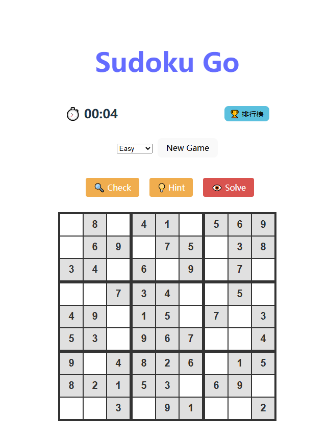

### 📄 README.md

```markdown
# 🧩 Sudoku Go - Full Stack Web Game

> 一个基于 **Golang 1.25** 和 **React 19** 构建的现代化数独对战平台。采用云原生架构，支持多难度生成、全球排行榜、实时冲突检测与智能提示功能。


## 🌟 在线体验 (Demo)

👉 **访问地址**: [https://sudoku-go.onrender.com]



## 🛠️ 技术栈 (Tech Stack)

本项目采用 **零成本 (Zero Cost)** 云原生架构，并使用了最新的技术栈版本：

### Backend (后端)
*   **Language**: Golang **1.25**
*   **Framework**: Gin (高性能 Web 框架)
*   **Database**: Turso (基于 LibSQL 的边缘数据库)
*   **Algorithm**: 回溯算法 (Backtracking) 生成数独终盘与挖洞逻辑

### Frontend (前端)
*   **Framework**: React **19** + Vite **7**
*   **Language**: JavaScript (ESModule)
*   **HTTP Client**: Axios
*   **Styling**: CSS3 (Responsive Design)

### DevOps (部署与运维)
*   **Containerization**: Docker (多阶段构建，Alpine 镜像)
*   **Hosting**: Render.com (Web Service + Static Site)
*   **CI/CD**: 基于 Git 的自动化部署

## ✨ 功能特性 (Features)

*   🎮 **多难度模式**：支持 Easy, Medium, Hard, Expert 四种难度。
*   🏆 **全球排行榜**：基于 Turso 数据库，记录玩家通关时间。
*   ⚡ **智能辅助**：
    *   **Check**: 实时检查并高亮冲突的格子。
    *   **Hint**: AI 智能填入一个正确数字（使用后不计入成绩）。
    *   **Solve**: 一键查看完整答案（放弃比赛）。
*   ⏱️ **计时系统**: 精确记录解题耗时。
*   📱 **响应式设计**: 适配桌面端与移动端。

## 🚀 本地运行指南 (Getting Started)

如果你想在本地运行此项目，请按照以下步骤操作。

### 1. 克隆项目
```bash
git clone https://github.com/your_user_name/sudoku-backend.git
cd sudoku-backend
```

### 2. 后端设置 (Backend Setup)
确保你已安装 Go 1.25+ 环境。

1.  **设置环境变量** (PowerShell 示例):
    ```powershell
    # 请替换为你自己的 Turso 数据库连接信息
    $env:TURSO_DATABASE_URL="libsql://your-db.turso.io"
    $env:TURSO_AUTH_TOKEN="your-very-long-token"
    ```
2.  **安装依赖并运行**:
    ```bash
    go mod download
    go run main.go
    ```
    后端将启动在 `http://localhost:8080`。

### 3. 前端设置 (Frontend Setup)
确保你已安装 Node.js (v20+)。

1.  **进入前端目录**:
    ```bash
    cd frontend
    ```
2.  **安装依赖**:
    ```bash
    npm install
    ```
3.  **启动开发服务器**:
    ```bash
    npm run dev
    ```
    访问 `http://localhost:5173` 开始游戏。

## 📂 项目结构 (Project Structure)

```text
sudoku-backend/
├── db/                 # 数据库连接与模型 (Turso/SQLite)
├── sudoku/             # 核心算法 (数独生成与求解)
├── frontend/           # React 19 前端项目源码
│   ├── src/
│   │   ├── App.jsx     # 主要游戏逻辑
│   │   └── App.css     # 样式文件
│   └── dist/           # 构建后的静态文件
├── main.go             # 后端入口与路由配置
├── Dockerfile          # 多阶段构建配置
├── go.mod              # Go 依赖管理
├── screenshots/        # 游戏截图
│   └── demo.png
└── README.md           # 项目文档
```

## 🔌 API 文档

后端提供 RESTful API 服务：

| Method | Endpoint | Description |
| :--- | :--- | :--- |
| `GET` | `/` | 健康检查 |
| `GET` | `/api/new-game?level={easy/medium/hard}` | 获取新的数独题目 |
| `POST` | `/api/submit-score` | 提交游戏成绩 |
| `GET` | `/api/leaderboard?difficulty={level}` | 获取排行榜数据 |

## 📄 License

MIT License
```